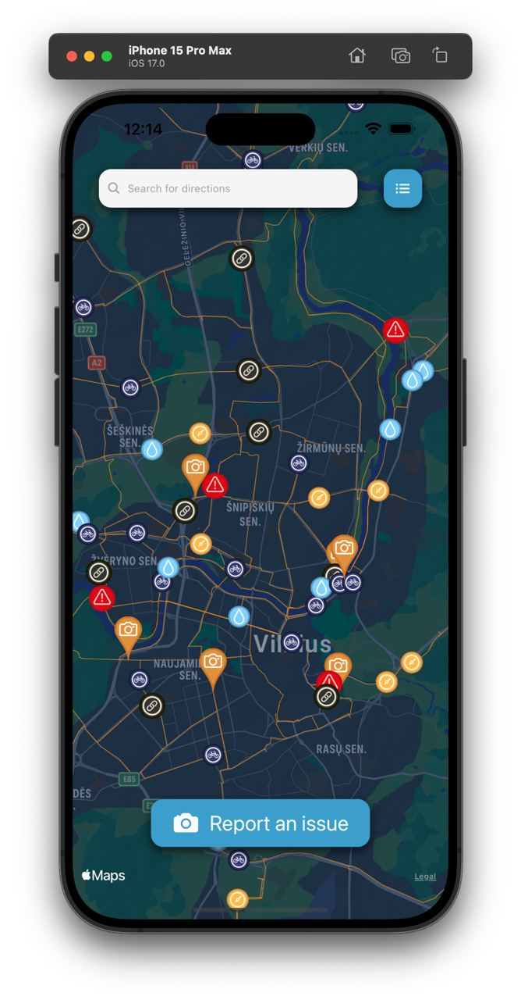
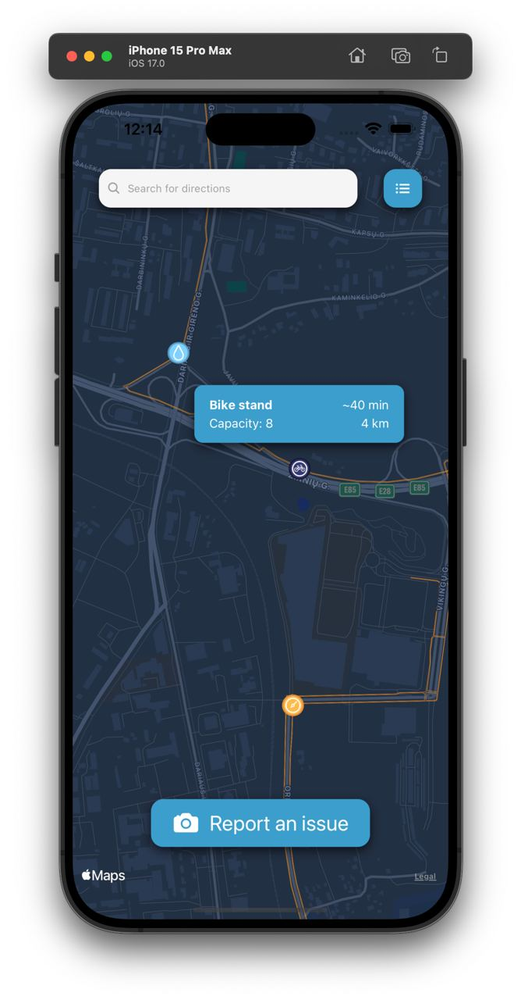
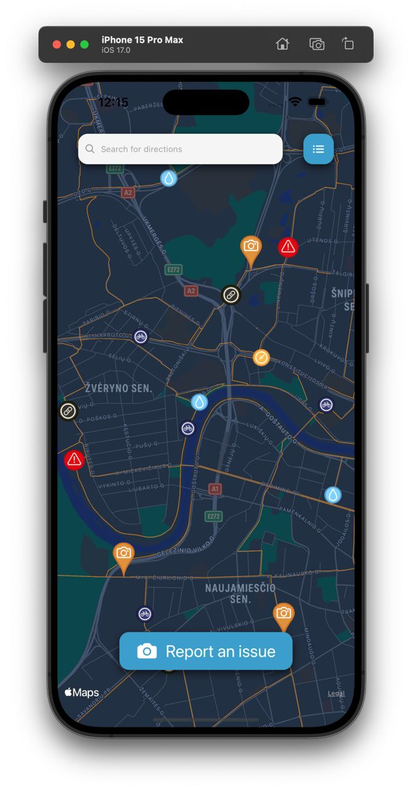
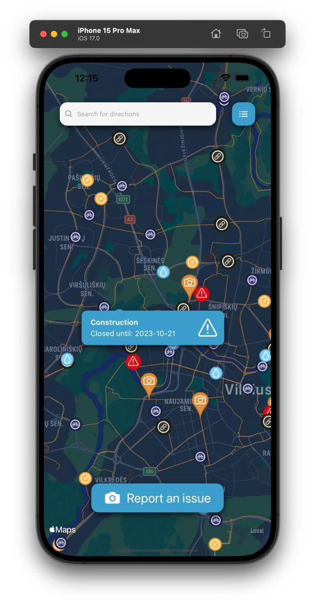

# Hack4Vilnius2023

A prototype app made for a Hack4Vilnius2023 hackaton. The app is focused on collecting infrastructure data. The cyclists which use the app can mark objects such as bike stands and report issues by taking a photo in their location.

Built using React Native.

